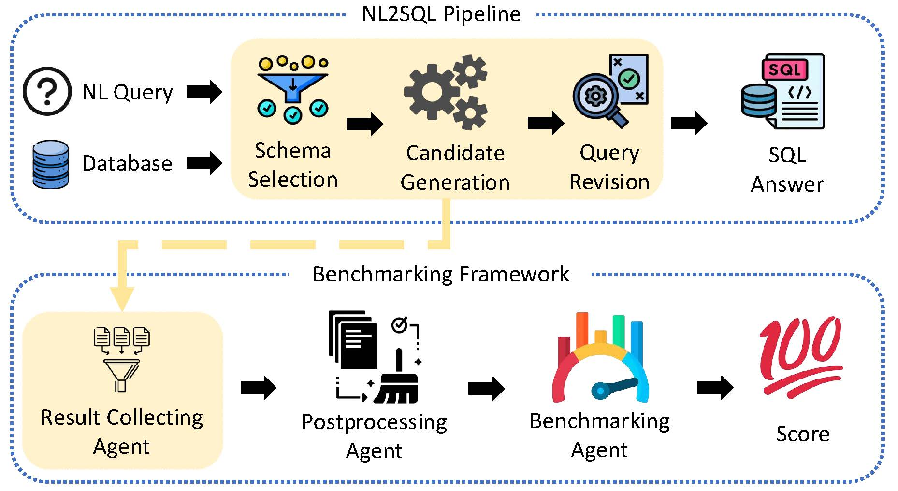

# NL2SQLBench: A Modular Benchmarking Framework for LLM-Enabled NL2SQL Solutions

## 🔍 Overview

Natural Language to SQL (NL2SQL) technology empowers non-expert users to query relational databases without requiring SQL expertise. While large language models (LLMs) have greatly improved NL2SQL algorithms, their rapid development outpaces systematic evaluation, leaving a critical gap in understanding their effectiveness, efficiency, and limitations. To this end, we present **NL2SQLBench**, the first modular evaluation and benchmarking framework for LLM-enabled NL2SQL approaches. Specifically, we dissect NL2SQL systems into three core modules: Schema Selection, Candidate Generation, and Query Revision. For each module, we comprehensively review existing strategies and propose novel fine-grained metrics that systematically quantify module-level effectiveness and efficiency. We further implement these metrics in a flexible multi-agent framework, allowing configurable benchmarking across diverse NL2SQL approaches. Leveraging **NL2SQLBench**, we rigorously evaluate ten representative open-source methods from the BIRD leaderboard on its widely adopted development dataset. We systematically assess each approach across the three core modules and evaluate multiple critical performance dimensions. Our evaluation reveals significant gaps in existing NL2SQL methods, highlighting not only substantial room for accuracy improvements but also the significant computational inefficiency, which severely hampers real-world adoption. Furthermore, our analysis identifies critical shortcomings in current benchmark datasets and evaluation rules, emphasizing issues such as inaccurate gold SQL annotations and limitations in existing evaluation rules. By synthesizing these detailed insights into a unified, transparent, and reproducible benchmarking, our study not only establishes a clear reference point for fair comparison across approaches but also serves as essential guidance for future targeted innovation in NL2SQL technology, thus advancing the practical deployment and real-world applicability of NL2SQL technologies.

## ⚙️ Framework Architecture

- **Result Collecting Agent**: This agent collects the results required for evaluation metrics from each module. It gathers selected schemas, candidate SQL queries, and refined SQL queries from the Schema Selection, Candidate Generation, and Query Revision modules, respectively. It also collects LLM usage statistics, such as token costs and the number of LLM calls. All the collected information is consolidated into structured JSON files
- **Postprocessing Agent**: This agent is responsible for transforming the raw outputs collected from upstream modules into a standardized and structured format suitable for downstream benchmarking.
- **Benchmarking Agent**: Utilizing the processed datasets, this agent performs a comprehensive and modular evaluation of each module within an NL2SQL solution. Specifically, it leverages the previously defined evaluation metrics and formalized equations to compute quantitative performance indicators for each module, including Schema Selection, Candidate Generation, and Query Revision. For each module, the agent aggregates relevant statistics and analyzes these metrics across varying difficulty levels of questions, enabling a granular 
assessment.